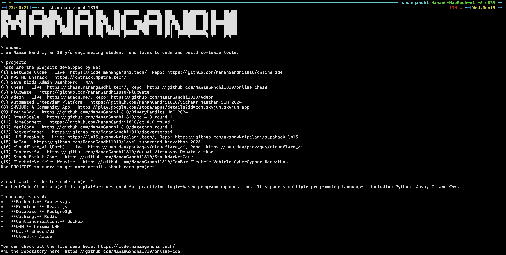

# Terminal Portfolio

My portfolio served in your terminal via netcat with an AI chatbot.



## Usage

```bash
nc sh.manan.cloud 1810
```

## How it works

This portfolio runs as an asyncio-based TCP server that accepts connections via netcat. When you connect:

1. The server sends a welcome banner
2. You can chat with an AI assistant powered by Google's Gemini
3. The AI has knowledge of my projects, skills, and background
4. Type `exit` to disconnect

The server maintains separate chat histories for each connected client and supports multiple concurrent connections.
